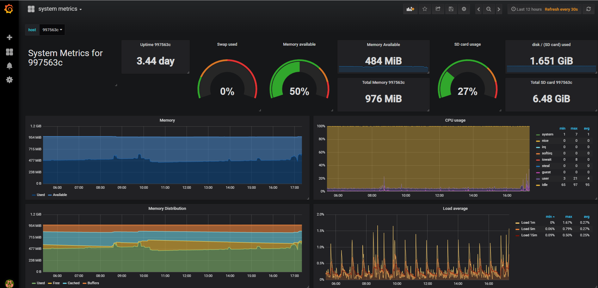
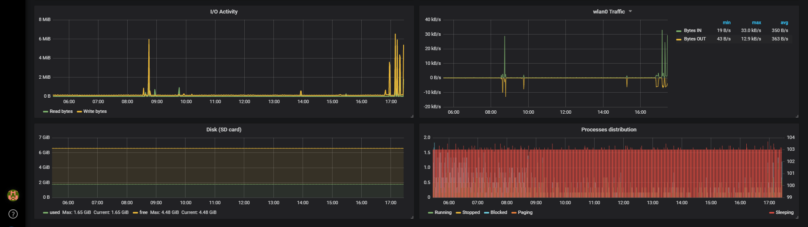

# Docker compose stack for Telegraf, InfluxDb, Grafana with configuration and dashboards for Raspberry Pi

## 1. What
This github repository describes a composite docker application that can be deployed on an arm device (e.g. a [Raspberry Pi 3 Model B+](https://www.raspberrypi.org/products/raspberry-pi-3-model-b-plus/)) running Raspian.

## 1.1 System resource monitoring using the TIG Stack (Telegraf, Influxdb & Grafana)
The system resource monitoring is realized by the TIG stack and happens as follows:
1. The [Telegraf](https://www.influxdata.com/time-series-platform/telegraf/) container collects the system resource metrics (memory, CPU, disk, network, ...) of the raspberry pi device and sends them to 
2. the [Influxdb](https://www.influxdata.com/) container that will store them in the influx database.  
3. The [Grafana](https://grafana.com/) container has a dashboard (see screenshot below) showing these system metrics that it has retrieved from the influxdb.

## 2 Telegraf
The table below specifies the environment variables that can be set in the Balena Device Service Variables panel for the Telegraf Service.  Note that the `Default Value` is defined in `docker-compose.yml`

| Name                     | Default Value  |  Description                                    |
|------------------------- | -------------- |-------------------------------------------------|
| **interval**             |    `60s`       | Frequency at which metrics are collected        |
| **flush_interval**       |    `60s`       | Flushing interval (should not set < `interval`) |

## 3. Grafana
The [Grafana](https://grafana.com/) user interface can be accessed at port 3000 of the host OS.
The login and password is `admin`.
The name of the dashboard is `system metrics`.

Here below a screenshot of the `system metrics` dashboard that is also provisioned by this application ( file is `grafana\dashboards\system metrics.json`)

## Credits
0. Forked from https://github.com/janvda/balena-node-red-mqtt-nginx-TIG-stack
1. [Initializing Grafana with preconfigured dashboards](https://ops.tips/blog/initialize-grafana-with-preconfigured-dashboards/)  [(github repository)](https://github.com/cirocosta/sample-grafana)
2. [InfluxDB system metrics dashboard](https://grafana.com/dashboards/1138)
3. [Grafana Series Part 1: Setting up InfluxDB, Grafana and Telegraf with Docker on Linux](https://blog.linuxserver.io/2017/11/25/how-to-monitor-your-server-using-grafana-influxdb-and-telegraf/)
